Class 5 Introduction to R graphics
================
Yvette Tan
2/12/19

Class 05 R graphics intro This is some test and I can have **bold** and *italic* and 'code'

``` r
# My first boxplot
x <- rnorm(1000,0)
boxplot(x)
```

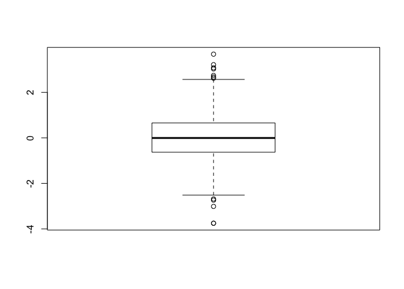

``` r
summary(x)
```

    ##      Min.   1st Qu.    Median      Mean   3rd Qu.      Max. 
    ## -3.754325 -0.631909 -0.005852  0.022502  0.655841  3.677558

``` r
hist(x)
```

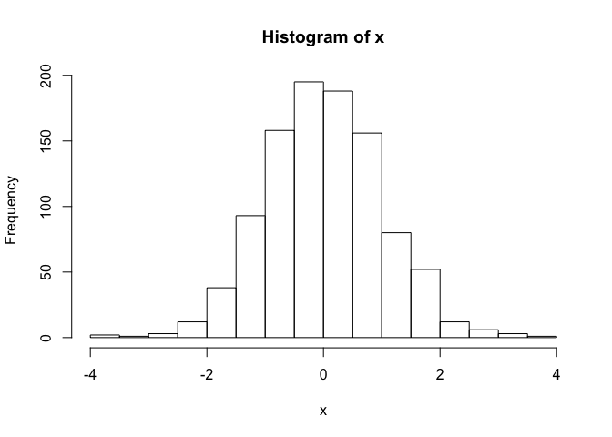

``` r
boxplot(x, horizontal = TRUE)
```

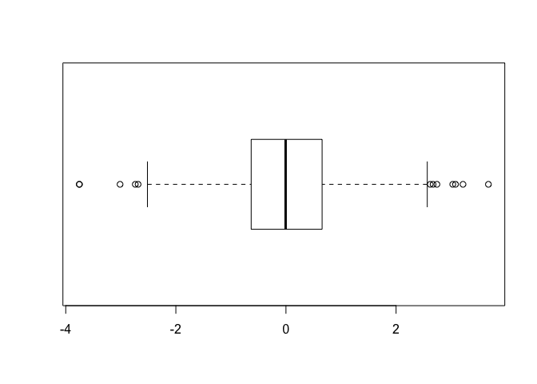

``` r
weight <- read.table("bimm143_05_rstats/weight_chart.txt", header = TRUE, sep = "") 
weight$Age
```

    ##  [1] 0 1 2 3 4 5 6 7 8 9

``` r
weight$Weight
```

    ##  [1] 3.6 4.4 5.2 6.0 6.6 7.2 7.8 8.4 8.8 9.2

``` r
plot(weight$Age, weight$Weight, type = "o", pch = 15, cex = 1.5, lwd = 2, ylim = c(2,10), xlab = "Age (months)", ylab= "Weight (kg)", main= "Weight by Age")
```

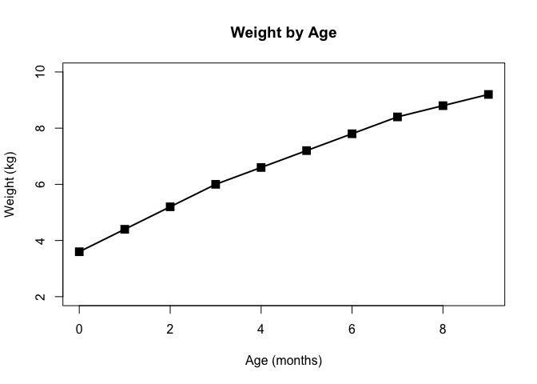

``` r
#using barplot
barplot(VADeaths, beside = FALSE)
```

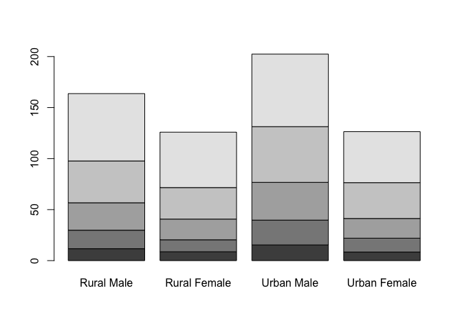

``` r
#input our feature count data
mouse <- read.table("bimm143_05_rstats/feature_counts.txt", header = TRUE, sep = "\t")
barplot(mouse$Count, horiz = TRUE, names.arg=mouse$Feature, main = "Some title", las = 2)
```

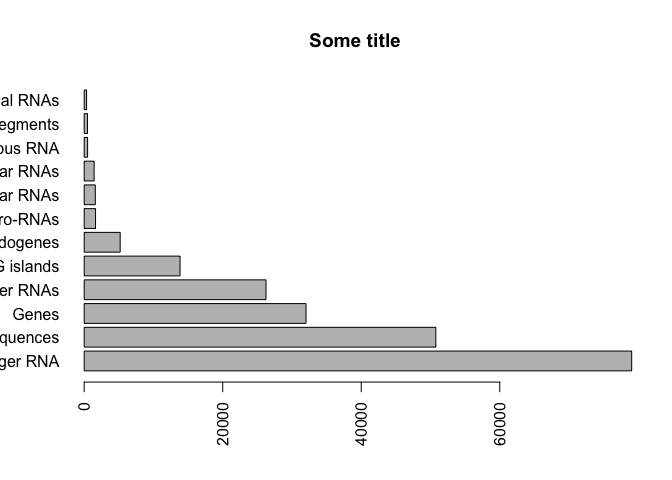

``` r
#change margin so that we can see labels
par(mar = c(3.1, 11.1, 4.1, 2))
barplot(mouse$Count, names.arg=mouse$Feature, horiz = TRUE, ylab = "", main = "Number of features in the mouse GRCm38 genome", las = 1, xlim =c(0,80000))
```

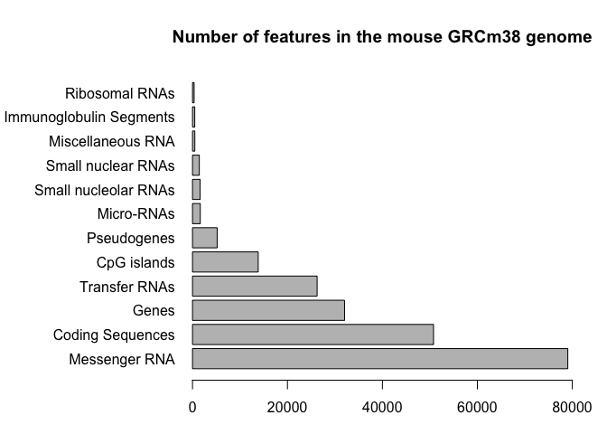

``` r
# $ is used as [,column]

#add some color
barplot(mouse$Count, horiz = TRUE, names.arg = mouse$Feature, las =2, col = rainbow(12))
```

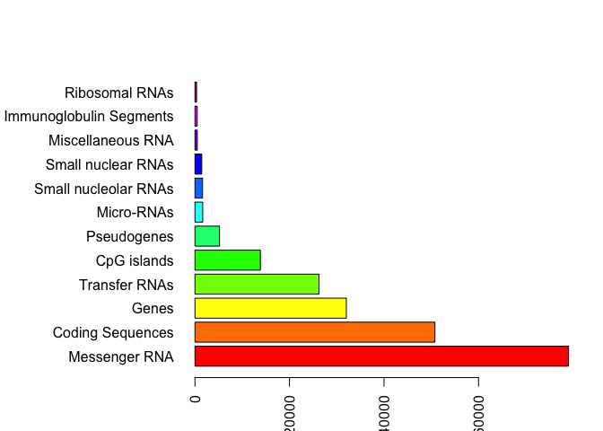

``` r
#histogram
hist(rnorm(10000), rnorm(10000)+4, breaks = 50)
```

    ## Warning in if (freq) x$counts else x$density: the condition has length > 1
    ## and only the first element will be used

    ## Warning in if (!freq) "Density" else "Frequency": the condition has length
    ## > 1 and only the first element will be used

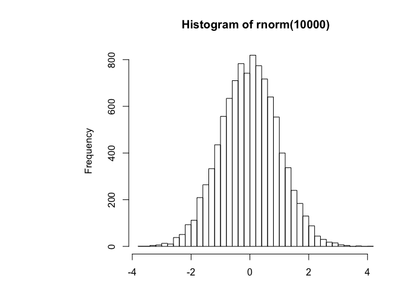

``` r
mf <- read.table("bimm143_05_rstats/male_female_counts.txt", header = TRUE, sep = "\t")
#barplot always needs height - use the Count column for this
barplot(mf$Count, names.arg = mf$Sample, horiz = FALSE,  las = 2, col=c("red", "blue"))
```

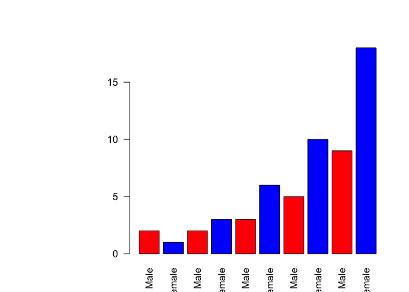

``` r
#Up Down Expression data

e<- read.table("bimm143_05_rstats/up_down_expression.txt", header = TRUE, sep = "")
#how many genes
nrow(e)
```

    ## [1] 5196

``` r
#how many up, down and changing?
table(e$State)
```

    ## 
    ##       down unchanging         up 
    ##         72       4997        127

``` r
plot(e$Condition1, e$Condition2, col = e$State)
```

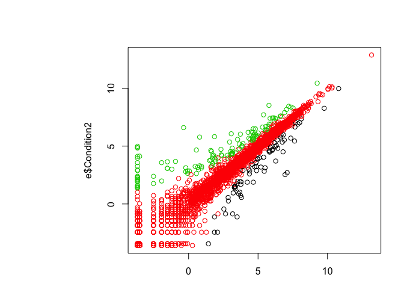

``` r
#plot
palette(c("red", "lightgray", "blue"))
plot(e$Condition1, e$Condition2, col = e$State)
```

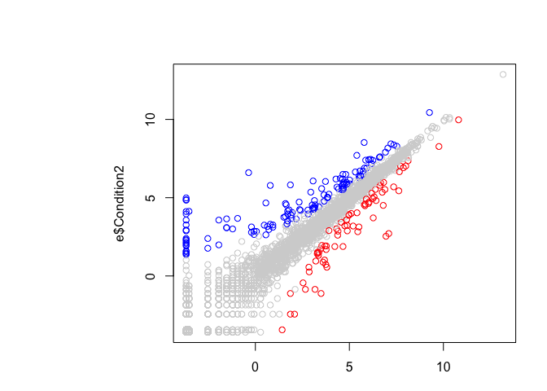
