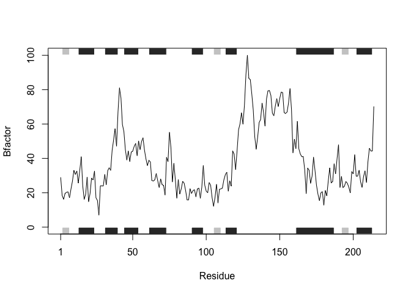
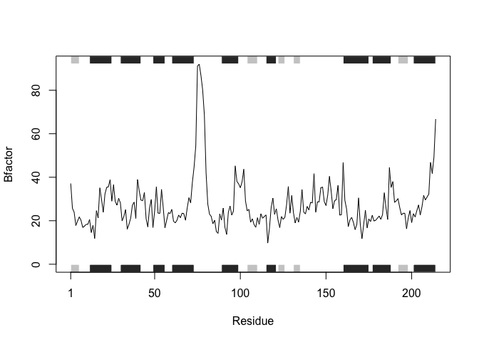

Homework question 6 due 1/31/19
================
Yvette Tan
1/29/2019

Set up a function that will take input as a protein (ex "4AKE"), read the pdb file, trim the file, and select the correct data to output a plot analyzing protein-drug interaction.
-----------------------------------------------------------------------------------------------------------------------------------------------------------------------------------

``` r
#need to install packages if necessary before function can be used
library("bio3d")
```

``` r
plotbio <- function(protein) {
  library("bio3d")
  #read.pdb() reads a Protein Data Bank coordinate file that was taken as input to the function
  s <- read.pdb(protein)
  #produce a new smaller PDB object
  s.chainA <- trim.pdb(s, chain = "A", elety = "CA")
  #call and use a subset of the data 
  s.b <- s.chainA$atom$b
  #plots selected data of the original inputted protein
  plotb3(s.b, sse = s.chainA,type = 'l', ylab = "Bfactor")
}
```

Examples of output

``` r
plotbio("4AKE")
```

    ##   Note: Accessing on-line PDB file



``` r
plotbio("1AKE")
```

    ##   Note: Accessing on-line PDB file
    ##    PDB has ALT records, taking A only, rm.alt=TRUE



``` r
plotbio("1E4Y")
```

    ##   Note: Accessing on-line PDB file


