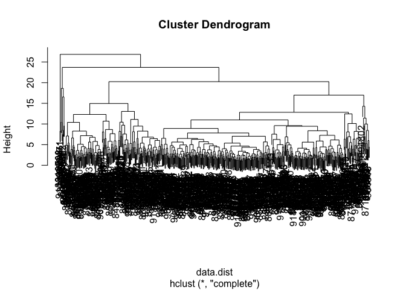
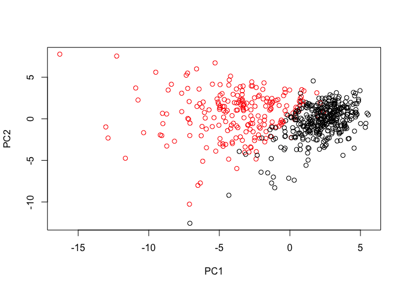

Class 9 Analysis of Human Breast Cancer Cells
================
Yvette Tan
2/7/2019

Data Analysis of Breast Cancer Cells
------------------------------------

``` r
fna.data <- "WisconsinCancer (1).csv"
wisc.df <- read.csv(fna.data)
```

``` r
head(wisc.df)
```

    ##         id diagnosis radius_mean texture_mean perimeter_mean area_mean
    ## 1   842302         M       17.99        10.38         122.80    1001.0
    ## 2   842517         M       20.57        17.77         132.90    1326.0
    ## 3 84300903         M       19.69        21.25         130.00    1203.0
    ## 4 84348301         M       11.42        20.38          77.58     386.1
    ## 5 84358402         M       20.29        14.34         135.10    1297.0
    ## 6   843786         M       12.45        15.70          82.57     477.1
    ##   smoothness_mean compactness_mean concavity_mean concave.points_mean
    ## 1         0.11840          0.27760         0.3001             0.14710
    ## 2         0.08474          0.07864         0.0869             0.07017
    ## 3         0.10960          0.15990         0.1974             0.12790
    ## 4         0.14250          0.28390         0.2414             0.10520
    ## 5         0.10030          0.13280         0.1980             0.10430
    ## 6         0.12780          0.17000         0.1578             0.08089
    ##   symmetry_mean fractal_dimension_mean radius_se texture_se perimeter_se
    ## 1        0.2419                0.07871    1.0950     0.9053        8.589
    ## 2        0.1812                0.05667    0.5435     0.7339        3.398
    ## 3        0.2069                0.05999    0.7456     0.7869        4.585
    ## 4        0.2597                0.09744    0.4956     1.1560        3.445
    ## 5        0.1809                0.05883    0.7572     0.7813        5.438
    ## 6        0.2087                0.07613    0.3345     0.8902        2.217
    ##   area_se smoothness_se compactness_se concavity_se concave.points_se
    ## 1  153.40      0.006399        0.04904      0.05373           0.01587
    ## 2   74.08      0.005225        0.01308      0.01860           0.01340
    ## 3   94.03      0.006150        0.04006      0.03832           0.02058
    ## 4   27.23      0.009110        0.07458      0.05661           0.01867
    ## 5   94.44      0.011490        0.02461      0.05688           0.01885
    ## 6   27.19      0.007510        0.03345      0.03672           0.01137
    ##   symmetry_se fractal_dimension_se radius_worst texture_worst
    ## 1     0.03003             0.006193        25.38         17.33
    ## 2     0.01389             0.003532        24.99         23.41
    ## 3     0.02250             0.004571        23.57         25.53
    ## 4     0.05963             0.009208        14.91         26.50
    ## 5     0.01756             0.005115        22.54         16.67
    ## 6     0.02165             0.005082        15.47         23.75
    ##   perimeter_worst area_worst smoothness_worst compactness_worst
    ## 1          184.60     2019.0           0.1622            0.6656
    ## 2          158.80     1956.0           0.1238            0.1866
    ## 3          152.50     1709.0           0.1444            0.4245
    ## 4           98.87      567.7           0.2098            0.8663
    ## 5          152.20     1575.0           0.1374            0.2050
    ## 6          103.40      741.6           0.1791            0.5249
    ##   concavity_worst concave.points_worst symmetry_worst
    ## 1          0.7119               0.2654         0.4601
    ## 2          0.2416               0.1860         0.2750
    ## 3          0.4504               0.2430         0.3613
    ## 4          0.6869               0.2575         0.6638
    ## 5          0.4000               0.1625         0.2364
    ## 6          0.5355               0.1741         0.3985
    ##   fractal_dimension_worst  X
    ## 1                 0.11890 NA
    ## 2                 0.08902 NA
    ## 3                 0.08758 NA
    ## 4                 0.17300 NA
    ## 5                 0.07678 NA
    ## 6                 0.12440 NA

How many samples (i.e. patients) are in this data-set?

``` r
nrow(wisc.df)
```

    ## [1] 569

Next use as.matrix() to convert the other features (i.e. columns) of the data (in columns 3 through 32) to a matrix. Store this in a variable called wisc.data.

``` r
wisc.data <- as.matrix(wisc.df[,3:32])
head(wisc.data)
```

    ##      radius_mean texture_mean perimeter_mean area_mean smoothness_mean
    ## [1,]       17.99        10.38         122.80    1001.0         0.11840
    ## [2,]       20.57        17.77         132.90    1326.0         0.08474
    ## [3,]       19.69        21.25         130.00    1203.0         0.10960
    ## [4,]       11.42        20.38          77.58     386.1         0.14250
    ## [5,]       20.29        14.34         135.10    1297.0         0.10030
    ## [6,]       12.45        15.70          82.57     477.1         0.12780
    ##      compactness_mean concavity_mean concave.points_mean symmetry_mean
    ## [1,]          0.27760         0.3001             0.14710        0.2419
    ## [2,]          0.07864         0.0869             0.07017        0.1812
    ## [3,]          0.15990         0.1974             0.12790        0.2069
    ## [4,]          0.28390         0.2414             0.10520        0.2597
    ## [5,]          0.13280         0.1980             0.10430        0.1809
    ## [6,]          0.17000         0.1578             0.08089        0.2087
    ##      fractal_dimension_mean radius_se texture_se perimeter_se area_se
    ## [1,]                0.07871    1.0950     0.9053        8.589  153.40
    ## [2,]                0.05667    0.5435     0.7339        3.398   74.08
    ## [3,]                0.05999    0.7456     0.7869        4.585   94.03
    ## [4,]                0.09744    0.4956     1.1560        3.445   27.23
    ## [5,]                0.05883    0.7572     0.7813        5.438   94.44
    ## [6,]                0.07613    0.3345     0.8902        2.217   27.19
    ##      smoothness_se compactness_se concavity_se concave.points_se
    ## [1,]      0.006399        0.04904      0.05373           0.01587
    ## [2,]      0.005225        0.01308      0.01860           0.01340
    ## [3,]      0.006150        0.04006      0.03832           0.02058
    ## [4,]      0.009110        0.07458      0.05661           0.01867
    ## [5,]      0.011490        0.02461      0.05688           0.01885
    ## [6,]      0.007510        0.03345      0.03672           0.01137
    ##      symmetry_se fractal_dimension_se radius_worst texture_worst
    ## [1,]     0.03003             0.006193        25.38         17.33
    ## [2,]     0.01389             0.003532        24.99         23.41
    ## [3,]     0.02250             0.004571        23.57         25.53
    ## [4,]     0.05963             0.009208        14.91         26.50
    ## [5,]     0.01756             0.005115        22.54         16.67
    ## [6,]     0.02165             0.005082        15.47         23.75
    ##      perimeter_worst area_worst smoothness_worst compactness_worst
    ## [1,]          184.60     2019.0           0.1622            0.6656
    ## [2,]          158.80     1956.0           0.1238            0.1866
    ## [3,]          152.50     1709.0           0.1444            0.4245
    ## [4,]           98.87      567.7           0.2098            0.8663
    ## [5,]          152.20     1575.0           0.1374            0.2050
    ## [6,]          103.40      741.6           0.1791            0.5249
    ##      concavity_worst concave.points_worst symmetry_worst
    ## [1,]          0.7119               0.2654         0.4601
    ## [2,]          0.2416               0.1860         0.2750
    ## [3,]          0.4504               0.2430         0.3613
    ## [4,]          0.6869               0.2575         0.6638
    ## [5,]          0.4000               0.1625         0.2364
    ## [6,]          0.5355               0.1741         0.3985
    ##      fractal_dimension_worst
    ## [1,]                 0.11890
    ## [2,]                 0.08902
    ## [3,]                 0.08758
    ## [4,]                 0.17300
    ## [5,]                 0.07678
    ## [6,]                 0.12440

Set the row names of wisc.data
==============================

``` r
row.names(wisc.data) <- wisc.df$id
head(wisc.data)
```

    ##          radius_mean texture_mean perimeter_mean area_mean smoothness_mean
    ## 842302         17.99        10.38         122.80    1001.0         0.11840
    ## 842517         20.57        17.77         132.90    1326.0         0.08474
    ## 84300903       19.69        21.25         130.00    1203.0         0.10960
    ## 84348301       11.42        20.38          77.58     386.1         0.14250
    ## 84358402       20.29        14.34         135.10    1297.0         0.10030
    ## 843786         12.45        15.70          82.57     477.1         0.12780
    ##          compactness_mean concavity_mean concave.points_mean symmetry_mean
    ## 842302            0.27760         0.3001             0.14710        0.2419
    ## 842517            0.07864         0.0869             0.07017        0.1812
    ## 84300903          0.15990         0.1974             0.12790        0.2069
    ## 84348301          0.28390         0.2414             0.10520        0.2597
    ## 84358402          0.13280         0.1980             0.10430        0.1809
    ## 843786            0.17000         0.1578             0.08089        0.2087
    ##          fractal_dimension_mean radius_se texture_se perimeter_se area_se
    ## 842302                  0.07871    1.0950     0.9053        8.589  153.40
    ## 842517                  0.05667    0.5435     0.7339        3.398   74.08
    ## 84300903                0.05999    0.7456     0.7869        4.585   94.03
    ## 84348301                0.09744    0.4956     1.1560        3.445   27.23
    ## 84358402                0.05883    0.7572     0.7813        5.438   94.44
    ## 843786                  0.07613    0.3345     0.8902        2.217   27.19
    ##          smoothness_se compactness_se concavity_se concave.points_se
    ## 842302        0.006399        0.04904      0.05373           0.01587
    ## 842517        0.005225        0.01308      0.01860           0.01340
    ## 84300903      0.006150        0.04006      0.03832           0.02058
    ## 84348301      0.009110        0.07458      0.05661           0.01867
    ## 84358402      0.011490        0.02461      0.05688           0.01885
    ## 843786        0.007510        0.03345      0.03672           0.01137
    ##          symmetry_se fractal_dimension_se radius_worst texture_worst
    ## 842302       0.03003             0.006193        25.38         17.33
    ## 842517       0.01389             0.003532        24.99         23.41
    ## 84300903     0.02250             0.004571        23.57         25.53
    ## 84348301     0.05963             0.009208        14.91         26.50
    ## 84358402     0.01756             0.005115        22.54         16.67
    ## 843786       0.02165             0.005082        15.47         23.75
    ##          perimeter_worst area_worst smoothness_worst compactness_worst
    ## 842302            184.60     2019.0           0.1622            0.6656
    ## 842517            158.80     1956.0           0.1238            0.1866
    ## 84300903          152.50     1709.0           0.1444            0.4245
    ## 84348301           98.87      567.7           0.2098            0.8663
    ## 84358402          152.20     1575.0           0.1374            0.2050
    ## 843786            103.40      741.6           0.1791            0.5249
    ##          concavity_worst concave.points_worst symmetry_worst
    ## 842302            0.7119               0.2654         0.4601
    ## 842517            0.2416               0.1860         0.2750
    ## 84300903          0.4504               0.2430         0.3613
    ## 84348301          0.6869               0.2575         0.6638
    ## 84358402          0.4000               0.1625         0.2364
    ## 843786            0.5355               0.1741         0.3985
    ##          fractal_dimension_worst
    ## 842302                   0.11890
    ## 842517                   0.08902
    ## 84300903                 0.08758
    ## 84348301                 0.17300
    ## 84358402                 0.07678
    ## 843786                   0.12440

Finally, setup a separate new vector called diagnosis to be 1 if a diagnosis is malignant ("M") and 0 otherwise. Note that R coerces TRUE to 1 and FALSE to 0.

How many cancer (M) and non cancer samples do we have in our dataset?

``` r
#wisc.df$diagnosis
table(wisc.df$diagnosis)
```

    ## 
    ##   B   M 
    ## 357 212

``` r
diagnosis <- as.numeric(wisc.df$diagnosis == "M")
diagnosis
```

    ##   [1] 1 1 1 1 1 1 1 1 1 1 1 1 1 1 1 1 1 1 1 0 0 0 1 1 1 1 1 1 1 1 1 1 1 1 1
    ##  [36] 1 1 0 1 1 1 1 1 1 1 1 0 1 0 0 0 0 0 1 1 0 1 1 0 0 0 0 1 0 1 1 0 0 0 0
    ##  [71] 1 0 1 1 0 1 0 1 1 0 0 0 1 1 0 1 1 1 0 0 0 1 0 0 1 1 0 0 0 1 1 0 0 0 0
    ## [106] 1 0 0 1 0 0 0 0 0 0 0 0 1 1 1 0 1 1 0 0 0 1 1 0 1 0 1 1 0 1 1 0 0 1 0
    ## [141] 0 1 0 0 0 0 1 0 0 0 0 0 0 0 0 0 1 0 0 0 0 1 1 0 1 0 0 1 1 0 0 1 1 0 0
    ## [176] 0 0 1 0 0 1 1 1 0 1 0 1 0 0 0 1 0 0 1 1 0 1 1 1 1 0 1 1 1 0 1 0 1 0 0
    ## [211] 1 0 1 1 1 1 0 0 1 1 0 0 0 1 0 0 0 0 0 1 1 0 0 1 0 0 1 1 0 1 0 0 0 0 1
    ## [246] 0 0 0 0 0 1 0 1 1 1 1 1 1 1 1 1 1 1 1 1 1 0 0 0 0 0 0 1 0 1 0 0 1 0 0
    ## [281] 1 0 1 1 0 0 0 0 0 0 0 0 0 0 0 0 0 1 0 0 1 0 1 0 0 0 0 0 0 0 0 0 0 0 0
    ## [316] 0 0 1 0 0 0 1 0 1 0 0 0 0 1 1 1 0 0 0 0 1 0 1 0 1 0 0 0 1 0 0 0 0 0 0
    ## [351] 0 1 1 1 0 0 0 0 0 0 0 0 0 0 0 1 1 0 1 1 1 0 1 1 0 0 0 0 0 1 0 0 0 0 0
    ## [386] 1 0 0 0 1 0 0 1 1 0 0 0 0 0 0 1 0 0 0 0 0 0 0 1 0 0 0 0 0 1 0 0 1 0 0
    ## [421] 0 0 0 0 0 0 0 0 0 0 1 0 1 1 0 1 0 0 0 0 0 1 0 0 1 0 1 0 0 1 0 1 0 0 0
    ## [456] 0 0 0 0 0 1 1 0 0 0 0 0 0 1 0 0 0 0 0 0 0 0 0 0 1 0 0 0 0 0 0 0 1 0 1
    ## [491] 0 0 1 0 0 0 0 0 1 1 0 1 0 1 0 0 0 0 0 1 0 0 1 0 1 0 1 1 0 0 0 1 0 0 0
    ## [526] 0 0 0 0 0 0 0 0 1 0 1 1 0 0 0 0 0 0 0 0 0 0 0 0 0 0 0 0 0 0 0 0 0 0 0
    ## [561] 0 0 1 1 1 1 1 1 0

Lets double check

``` r
cbind(diagnosis, wisc.df$diagnosis)
```

    ##        diagnosis  
    ##   [1,]         1 2
    ##   [2,]         1 2
    ##   [3,]         1 2
    ##   [4,]         1 2
    ##   [5,]         1 2
    ##   [6,]         1 2
    ##   [7,]         1 2
    ##   [8,]         1 2
    ##   [9,]         1 2
    ##  [10,]         1 2
    ##  [11,]         1 2
    ##  [12,]         1 2
    ##  [13,]         1 2
    ##  [14,]         1 2
    ##  [15,]         1 2
    ##  [16,]         1 2
    ##  [17,]         1 2
    ##  [18,]         1 2
    ##  [19,]         1 2
    ##  [20,]         0 1
    ##  [21,]         0 1
    ##  [22,]         0 1
    ##  [23,]         1 2
    ##  [24,]         1 2
    ##  [25,]         1 2
    ##  [26,]         1 2
    ##  [27,]         1 2
    ##  [28,]         1 2
    ##  [29,]         1 2
    ##  [30,]         1 2
    ##  [31,]         1 2
    ##  [32,]         1 2
    ##  [33,]         1 2
    ##  [34,]         1 2
    ##  [35,]         1 2
    ##  [36,]         1 2
    ##  [37,]         1 2
    ##  [38,]         0 1
    ##  [39,]         1 2
    ##  [40,]         1 2
    ##  [41,]         1 2
    ##  [42,]         1 2
    ##  [43,]         1 2
    ##  [44,]         1 2
    ##  [45,]         1 2
    ##  [46,]         1 2
    ##  [47,]         0 1
    ##  [48,]         1 2
    ##  [49,]         0 1
    ##  [50,]         0 1
    ##  [51,]         0 1
    ##  [52,]         0 1
    ##  [53,]         0 1
    ##  [54,]         1 2
    ##  [55,]         1 2
    ##  [56,]         0 1
    ##  [57,]         1 2
    ##  [58,]         1 2
    ##  [59,]         0 1
    ##  [60,]         0 1
    ##  [61,]         0 1
    ##  [62,]         0 1
    ##  [63,]         1 2
    ##  [64,]         0 1
    ##  [65,]         1 2
    ##  [66,]         1 2
    ##  [67,]         0 1
    ##  [68,]         0 1
    ##  [69,]         0 1
    ##  [70,]         0 1
    ##  [71,]         1 2
    ##  [72,]         0 1
    ##  [73,]         1 2
    ##  [74,]         1 2
    ##  [75,]         0 1
    ##  [76,]         1 2
    ##  [77,]         0 1
    ##  [78,]         1 2
    ##  [79,]         1 2
    ##  [80,]         0 1
    ##  [81,]         0 1
    ##  [82,]         0 1
    ##  [83,]         1 2
    ##  [84,]         1 2
    ##  [85,]         0 1
    ##  [86,]         1 2
    ##  [87,]         1 2
    ##  [88,]         1 2
    ##  [89,]         0 1
    ##  [90,]         0 1
    ##  [91,]         0 1
    ##  [92,]         1 2
    ##  [93,]         0 1
    ##  [94,]         0 1
    ##  [95,]         1 2
    ##  [96,]         1 2
    ##  [97,]         0 1
    ##  [98,]         0 1
    ##  [99,]         0 1
    ## [100,]         1 2
    ## [101,]         1 2
    ## [102,]         0 1
    ## [103,]         0 1
    ## [104,]         0 1
    ## [105,]         0 1
    ## [106,]         1 2
    ## [107,]         0 1
    ## [108,]         0 1
    ## [109,]         1 2
    ## [110,]         0 1
    ## [111,]         0 1
    ## [112,]         0 1
    ## [113,]         0 1
    ## [114,]         0 1
    ## [115,]         0 1
    ## [116,]         0 1
    ## [117,]         0 1
    ## [118,]         1 2
    ## [119,]         1 2
    ## [120,]         1 2
    ## [121,]         0 1
    ## [122,]         1 2
    ## [123,]         1 2
    ## [124,]         0 1
    ## [125,]         0 1
    ## [126,]         0 1
    ## [127,]         1 2
    ## [128,]         1 2
    ## [129,]         0 1
    ## [130,]         1 2
    ## [131,]         0 1
    ## [132,]         1 2
    ## [133,]         1 2
    ## [134,]         0 1
    ## [135,]         1 2
    ## [136,]         1 2
    ## [137,]         0 1
    ## [138,]         0 1
    ## [139,]         1 2
    ## [140,]         0 1
    ## [141,]         0 1
    ## [142,]         1 2
    ## [143,]         0 1
    ## [144,]         0 1
    ## [145,]         0 1
    ## [146,]         0 1
    ## [147,]         1 2
    ## [148,]         0 1
    ## [149,]         0 1
    ## [150,]         0 1
    ## [151,]         0 1
    ## [152,]         0 1
    ## [153,]         0 1
    ## [154,]         0 1
    ## [155,]         0 1
    ## [156,]         0 1
    ## [157,]         1 2
    ## [158,]         0 1
    ## [159,]         0 1
    ## [160,]         0 1
    ## [161,]         0 1
    ## [162,]         1 2
    ## [163,]         1 2
    ## [164,]         0 1
    ## [165,]         1 2
    ## [166,]         0 1
    ## [167,]         0 1
    ## [168,]         1 2
    ## [169,]         1 2
    ## [170,]         0 1
    ## [171,]         0 1
    ## [172,]         1 2
    ## [173,]         1 2
    ## [174,]         0 1
    ## [175,]         0 1
    ## [176,]         0 1
    ## [177,]         0 1
    ## [178,]         1 2
    ## [179,]         0 1
    ## [180,]         0 1
    ## [181,]         1 2
    ## [182,]         1 2
    ## [183,]         1 2
    ## [184,]         0 1
    ## [185,]         1 2
    ## [186,]         0 1
    ## [187,]         1 2
    ## [188,]         0 1
    ## [189,]         0 1
    ## [190,]         0 1
    ## [191,]         1 2
    ## [192,]         0 1
    ## [193,]         0 1
    ## [194,]         1 2
    ## [195,]         1 2
    ## [196,]         0 1
    ## [197,]         1 2
    ## [198,]         1 2
    ## [199,]         1 2
    ## [200,]         1 2
    ## [201,]         0 1
    ## [202,]         1 2
    ## [203,]         1 2
    ## [204,]         1 2
    ## [205,]         0 1
    ## [206,]         1 2
    ## [207,]         0 1
    ## [208,]         1 2
    ## [209,]         0 1
    ## [210,]         0 1
    ## [211,]         1 2
    ## [212,]         0 1
    ## [213,]         1 2
    ## [214,]         1 2
    ## [215,]         1 2
    ## [216,]         1 2
    ## [217,]         0 1
    ## [218,]         0 1
    ## [219,]         1 2
    ## [220,]         1 2
    ## [221,]         0 1
    ## [222,]         0 1
    ## [223,]         0 1
    ## [224,]         1 2
    ## [225,]         0 1
    ## [226,]         0 1
    ## [227,]         0 1
    ## [228,]         0 1
    ## [229,]         0 1
    ## [230,]         1 2
    ## [231,]         1 2
    ## [232,]         0 1
    ## [233,]         0 1
    ## [234,]         1 2
    ## [235,]         0 1
    ## [236,]         0 1
    ## [237,]         1 2
    ## [238,]         1 2
    ## [239,]         0 1
    ## [240,]         1 2
    ## [241,]         0 1
    ## [242,]         0 1
    ## [243,]         0 1
    ## [244,]         0 1
    ## [245,]         1 2
    ## [246,]         0 1
    ## [247,]         0 1
    ## [248,]         0 1
    ## [249,]         0 1
    ## [250,]         0 1
    ## [251,]         1 2
    ## [252,]         0 1
    ## [253,]         1 2
    ## [254,]         1 2
    ## [255,]         1 2
    ## [256,]         1 2
    ## [257,]         1 2
    ## [258,]         1 2
    ## [259,]         1 2
    ## [260,]         1 2
    ## [261,]         1 2
    ## [262,]         1 2
    ## [263,]         1 2
    ## [264,]         1 2
    ## [265,]         1 2
    ## [266,]         1 2
    ## [267,]         0 1
    ## [268,]         0 1
    ## [269,]         0 1
    ## [270,]         0 1
    ## [271,]         0 1
    ## [272,]         0 1
    ## [273,]         1 2
    ## [274,]         0 1
    ## [275,]         1 2
    ## [276,]         0 1
    ## [277,]         0 1
    ## [278,]         1 2
    ## [279,]         0 1
    ## [280,]         0 1
    ## [281,]         1 2
    ## [282,]         0 1
    ## [283,]         1 2
    ## [284,]         1 2
    ## [285,]         0 1
    ## [286,]         0 1
    ## [287,]         0 1
    ## [288,]         0 1
    ## [289,]         0 1
    ## [290,]         0 1
    ## [291,]         0 1
    ## [292,]         0 1
    ## [293,]         0 1
    ## [294,]         0 1
    ## [295,]         0 1
    ## [296,]         0 1
    ## [297,]         0 1
    ## [298,]         1 2
    ## [299,]         0 1
    ## [300,]         0 1
    ## [301,]         1 2
    ## [302,]         0 1
    ## [303,]         1 2
    ## [304,]         0 1
    ## [305,]         0 1
    ## [306,]         0 1
    ## [307,]         0 1
    ## [308,]         0 1
    ## [309,]         0 1
    ## [310,]         0 1
    ## [311,]         0 1
    ## [312,]         0 1
    ## [313,]         0 1
    ## [314,]         0 1
    ## [315,]         0 1
    ## [316,]         0 1
    ## [317,]         0 1
    ## [318,]         1 2
    ## [319,]         0 1
    ## [320,]         0 1
    ## [321,]         0 1
    ## [322,]         1 2
    ## [323,]         0 1
    ## [324,]         1 2
    ## [325,]         0 1
    ## [326,]         0 1
    ## [327,]         0 1
    ## [328,]         0 1
    ## [329,]         1 2
    ## [330,]         1 2
    ## [331,]         1 2
    ## [332,]         0 1
    ## [333,]         0 1
    ## [334,]         0 1
    ## [335,]         0 1
    ## [336,]         1 2
    ## [337,]         0 1
    ## [338,]         1 2
    ## [339,]         0 1
    ## [340,]         1 2
    ## [341,]         0 1
    ## [342,]         0 1
    ## [343,]         0 1
    ## [344,]         1 2
    ## [345,]         0 1
    ## [346,]         0 1
    ## [347,]         0 1
    ## [348,]         0 1
    ## [349,]         0 1
    ## [350,]         0 1
    ## [351,]         0 1
    ## [352,]         1 2
    ## [353,]         1 2
    ## [354,]         1 2
    ## [355,]         0 1
    ## [356,]         0 1
    ## [357,]         0 1
    ## [358,]         0 1
    ## [359,]         0 1
    ## [360,]         0 1
    ## [361,]         0 1
    ## [362,]         0 1
    ## [363,]         0 1
    ## [364,]         0 1
    ## [365,]         0 1
    ## [366,]         1 2
    ## [367,]         1 2
    ## [368,]         0 1
    ## [369,]         1 2
    ## [370,]         1 2
    ## [371,]         1 2
    ## [372,]         0 1
    ## [373,]         1 2
    ## [374,]         1 2
    ## [375,]         0 1
    ## [376,]         0 1
    ## [377,]         0 1
    ## [378,]         0 1
    ## [379,]         0 1
    ## [380,]         1 2
    ## [381,]         0 1
    ## [382,]         0 1
    ## [383,]         0 1
    ## [384,]         0 1
    ## [385,]         0 1
    ## [386,]         1 2
    ## [387,]         0 1
    ## [388,]         0 1
    ## [389,]         0 1
    ## [390,]         1 2
    ## [391,]         0 1
    ## [392,]         0 1
    ## [393,]         1 2
    ## [394,]         1 2
    ## [395,]         0 1
    ## [396,]         0 1
    ## [397,]         0 1
    ## [398,]         0 1
    ## [399,]         0 1
    ## [400,]         0 1
    ## [401,]         1 2
    ## [402,]         0 1
    ## [403,]         0 1
    ## [404,]         0 1
    ## [405,]         0 1
    ## [406,]         0 1
    ## [407,]         0 1
    ## [408,]         0 1
    ## [409,]         1 2
    ## [410,]         0 1
    ## [411,]         0 1
    ## [412,]         0 1
    ## [413,]         0 1
    ## [414,]         0 1
    ## [415,]         1 2
    ## [416,]         0 1
    ## [417,]         0 1
    ## [418,]         1 2
    ## [419,]         0 1
    ## [420,]         0 1
    ## [421,]         0 1
    ## [422,]         0 1
    ## [423,]         0 1
    ## [424,]         0 1
    ## [425,]         0 1
    ## [426,]         0 1
    ## [427,]         0 1
    ## [428,]         0 1
    ## [429,]         0 1
    ## [430,]         0 1
    ## [431,]         1 2
    ## [432,]         0 1
    ## [433,]         1 2
    ## [434,]         1 2
    ## [435,]         0 1
    ## [436,]         1 2
    ## [437,]         0 1
    ## [438,]         0 1
    ## [439,]         0 1
    ## [440,]         0 1
    ## [441,]         0 1
    ## [442,]         1 2
    ## [443,]         0 1
    ## [444,]         0 1
    ## [445,]         1 2
    ## [446,]         0 1
    ## [447,]         1 2
    ## [448,]         0 1
    ## [449,]         0 1
    ## [450,]         1 2
    ## [451,]         0 1
    ## [452,]         1 2
    ## [453,]         0 1
    ## [454,]         0 1
    ## [455,]         0 1
    ## [456,]         0 1
    ## [457,]         0 1
    ## [458,]         0 1
    ## [459,]         0 1
    ## [460,]         0 1
    ## [461,]         1 2
    ## [462,]         1 2
    ## [463,]         0 1
    ## [464,]         0 1
    ## [465,]         0 1
    ## [466,]         0 1
    ## [467,]         0 1
    ## [468,]         0 1
    ## [469,]         1 2
    ## [470,]         0 1
    ## [471,]         0 1
    ## [472,]         0 1
    ## [473,]         0 1
    ## [474,]         0 1
    ## [475,]         0 1
    ## [476,]         0 1
    ## [477,]         0 1
    ## [478,]         0 1
    ## [479,]         0 1
    ## [480,]         1 2
    ## [481,]         0 1
    ## [482,]         0 1
    ## [483,]         0 1
    ## [484,]         0 1
    ## [485,]         0 1
    ## [486,]         0 1
    ## [487,]         0 1
    ## [488,]         1 2
    ## [489,]         0 1
    ## [490,]         1 2
    ## [491,]         0 1
    ## [492,]         0 1
    ## [493,]         1 2
    ## [494,]         0 1
    ## [495,]         0 1
    ## [496,]         0 1
    ## [497,]         0 1
    ## [498,]         0 1
    ## [499,]         1 2
    ## [500,]         1 2
    ## [501,]         0 1
    ## [502,]         1 2
    ## [503,]         0 1
    ## [504,]         1 2
    ## [505,]         0 1
    ## [506,]         0 1
    ## [507,]         0 1
    ## [508,]         0 1
    ## [509,]         0 1
    ## [510,]         1 2
    ## [511,]         0 1
    ## [512,]         0 1
    ## [513,]         1 2
    ## [514,]         0 1
    ## [515,]         1 2
    ## [516,]         0 1
    ## [517,]         1 2
    ## [518,]         1 2
    ## [519,]         0 1
    ## [520,]         0 1
    ## [521,]         0 1
    ## [522,]         1 2
    ## [523,]         0 1
    ## [524,]         0 1
    ## [525,]         0 1
    ## [526,]         0 1
    ## [527,]         0 1
    ## [528,]         0 1
    ## [529,]         0 1
    ## [530,]         0 1
    ## [531,]         0 1
    ## [532,]         0 1
    ## [533,]         0 1
    ## [534,]         1 2
    ## [535,]         0 1
    ## [536,]         1 2
    ## [537,]         1 2
    ## [538,]         0 1
    ## [539,]         0 1
    ## [540,]         0 1
    ## [541,]         0 1
    ## [542,]         0 1
    ## [543,]         0 1
    ## [544,]         0 1
    ## [545,]         0 1
    ## [546,]         0 1
    ## [547,]         0 1
    ## [548,]         0 1
    ## [549,]         0 1
    ## [550,]         0 1
    ## [551,]         0 1
    ## [552,]         0 1
    ## [553,]         0 1
    ## [554,]         0 1
    ## [555,]         0 1
    ## [556,]         0 1
    ## [557,]         0 1
    ## [558,]         0 1
    ## [559,]         0 1
    ## [560,]         0 1
    ## [561,]         0 1
    ## [562,]         0 1
    ## [563,]         1 2
    ## [564,]         1 2
    ## [565,]         1 2
    ## [566,]         1 2
    ## [567,]         1 2
    ## [568,]         1 2
    ## [569,]         0 1

Q1. How many observations are in this dataset?

``` r
nrow(wisc.data)
```

    ## [1] 569

Q2. How many variables/features in the data are suffixed with \_mean?

``` r
inds <- grep("_mean", colnames(wisc.data))
length(inds)
```

    ## [1] 10

Q3. How many of the observations have a malignant diagnosis?

``` r
sum(diagnosis)
```

    ## [1] 212

2. Principal Component Analysis
-------------------------------

Check the mean and standard deviation of the features (i.e. columns) of the wisc.data to determine if the data should be scaled. Use the colMeans() and apply() functions like you’ve done before.

``` r
# Check column means and standard deviations
colMeans(wisc.data)
```

    ##             radius_mean            texture_mean          perimeter_mean 
    ##            1.412729e+01            1.928965e+01            9.196903e+01 
    ##               area_mean         smoothness_mean        compactness_mean 
    ##            6.548891e+02            9.636028e-02            1.043410e-01 
    ##          concavity_mean     concave.points_mean           symmetry_mean 
    ##            8.879932e-02            4.891915e-02            1.811619e-01 
    ##  fractal_dimension_mean               radius_se              texture_se 
    ##            6.279761e-02            4.051721e-01            1.216853e+00 
    ##            perimeter_se                 area_se           smoothness_se 
    ##            2.866059e+00            4.033708e+01            7.040979e-03 
    ##          compactness_se            concavity_se       concave.points_se 
    ##            2.547814e-02            3.189372e-02            1.179614e-02 
    ##             symmetry_se    fractal_dimension_se            radius_worst 
    ##            2.054230e-02            3.794904e-03            1.626919e+01 
    ##           texture_worst         perimeter_worst              area_worst 
    ##            2.567722e+01            1.072612e+02            8.805831e+02 
    ##        smoothness_worst       compactness_worst         concavity_worst 
    ##            1.323686e-01            2.542650e-01            2.721885e-01 
    ##    concave.points_worst          symmetry_worst fractal_dimension_worst 
    ##            1.146062e-01            2.900756e-01            8.394582e-02

``` r
apply(wisc.data,2,sd)
```

    ##             radius_mean            texture_mean          perimeter_mean 
    ##            3.524049e+00            4.301036e+00            2.429898e+01 
    ##               area_mean         smoothness_mean        compactness_mean 
    ##            3.519141e+02            1.406413e-02            5.281276e-02 
    ##          concavity_mean     concave.points_mean           symmetry_mean 
    ##            7.971981e-02            3.880284e-02            2.741428e-02 
    ##  fractal_dimension_mean               radius_se              texture_se 
    ##            7.060363e-03            2.773127e-01            5.516484e-01 
    ##            perimeter_se                 area_se           smoothness_se 
    ##            2.021855e+00            4.549101e+01            3.002518e-03 
    ##          compactness_se            concavity_se       concave.points_se 
    ##            1.790818e-02            3.018606e-02            6.170285e-03 
    ##             symmetry_se    fractal_dimension_se            radius_worst 
    ##            8.266372e-03            2.646071e-03            4.833242e+00 
    ##           texture_worst         perimeter_worst              area_worst 
    ##            6.146258e+00            3.360254e+01            5.693570e+02 
    ##        smoothness_worst       compactness_worst         concavity_worst 
    ##            2.283243e-02            1.573365e-01            2.086243e-01 
    ##    concave.points_worst          symmetry_worst fractal_dimension_worst 
    ##            6.573234e-02            6.186747e-02            1.806127e-02

Execute PCA with the prcomp() function on the wisc.data, scaling if appropriate, and assign the output model to wisc.pr.

``` r
# Perform PCA on wisc.data by completing the following code
wisc.pr <- prcomp(wisc.data, scale = TRUE)
summary(wisc.pr)
```

    ## Importance of components:
    ##                           PC1    PC2     PC3     PC4     PC5     PC6
    ## Standard deviation     3.6444 2.3857 1.67867 1.40735 1.28403 1.09880
    ## Proportion of Variance 0.4427 0.1897 0.09393 0.06602 0.05496 0.04025
    ## Cumulative Proportion  0.4427 0.6324 0.72636 0.79239 0.84734 0.88759
    ##                            PC7     PC8    PC9    PC10   PC11    PC12
    ## Standard deviation     0.82172 0.69037 0.6457 0.59219 0.5421 0.51104
    ## Proportion of Variance 0.02251 0.01589 0.0139 0.01169 0.0098 0.00871
    ## Cumulative Proportion  0.91010 0.92598 0.9399 0.95157 0.9614 0.97007
    ##                           PC13    PC14    PC15    PC16    PC17    PC18
    ## Standard deviation     0.49128 0.39624 0.30681 0.28260 0.24372 0.22939
    ## Proportion of Variance 0.00805 0.00523 0.00314 0.00266 0.00198 0.00175
    ## Cumulative Proportion  0.97812 0.98335 0.98649 0.98915 0.99113 0.99288
    ##                           PC19    PC20   PC21    PC22    PC23   PC24
    ## Standard deviation     0.22244 0.17652 0.1731 0.16565 0.15602 0.1344
    ## Proportion of Variance 0.00165 0.00104 0.0010 0.00091 0.00081 0.0006
    ## Cumulative Proportion  0.99453 0.99557 0.9966 0.99749 0.99830 0.9989
    ##                           PC25    PC26    PC27    PC28    PC29    PC30
    ## Standard deviation     0.12442 0.09043 0.08307 0.03987 0.02736 0.01153
    ## Proportion of Variance 0.00052 0.00027 0.00023 0.00005 0.00002 0.00000
    ## Cumulative Proportion  0.99942 0.99969 0.99992 0.99997 1.00000 1.00000

Q4. From your results, what proportion of the original variance is captured by the first principal components (PC1)? 44.27% if you want 80% -&gt; PC5

Q5. How many principal components (PCs) are required to describe at least 70% of the original variance in the data? 3

Q6. How many principal components (PCs) are required to describe at least 90% of the original variance in the data?

7

We need to make our own PCA plot

``` r
plot(wisc.pr$x[,1], wisc.pr$x[,2], xlab = "PC1", ylab = "PC2")
```


``` r
#diagnosis is a vector of 1's and 0's, so anything that is a 0 becomes white. If you change it to a vector of 1 and 2, there's black and red.
plot(wisc.pr$x[,1], wisc.pr$x[,2], xlab = "PC1", ylab = "PC2", col = diagnosis+1)
```


Q8. Generate a similar plot for principal components 1 and 3. What do you notice about these plots?

``` r
plot(wisc.pr$x[,1], wisc.pr$x[,3], xlab = "PC1", ylab = "PC3", col = diagnosis+1)
```


Variance captured in each PC
----------------------------

Calculate the variance of each principal component by squaring the sdev component of wisc.pr (i.e. wisc.pr$sdev^2). Save the result as an object called pr.var.

Square of standard deviation = variance

This info is in the $sdev component of our PCA result

``` r
# Calculate variance of each component
variance <- wisc.pr$sdev^2
#Calculate the variance explained by each principal component
(variance/sum(variance)) * 100
```

    ##  [1] 4.427203e+01 1.897118e+01 9.393163e+00 6.602135e+00 5.495768e+00
    ##  [6] 4.024522e+00 2.250734e+00 1.588724e+00 1.389649e+00 1.168978e+00
    ## [11] 9.797190e-01 8.705379e-01 8.045250e-01 5.233657e-01 3.137832e-01
    ## [16] 2.662093e-01 1.979968e-01 1.753959e-01 1.649253e-01 1.038647e-01
    ## [21] 9.990965e-02 9.146468e-02 8.113613e-02 6.018336e-02 5.160424e-02
    ## [26] 2.725880e-02 2.300155e-02 5.297793e-03 2.496010e-03 4.434827e-04

``` r
#Proportion of total variance
pve <- round((variance/sum(variance)) *100,1)
```

create a plot of variance explained for each principal component.

``` r
plot(pve, typ = "o", xlab = "Principal Component", 
     ylab = "Proportion of Variance Explained")
```


``` r
# Plot variance explained for each principal component
plot(pve, xlab = "Principal Component", 
     ylab = "Proportion of Variance Explained", 
     ylim = c(0, 1), type = "o")
```


``` r
# Alternative scree plot of the same data, note data driven y-axis
#paste0 has no space in between, paste adds whatever type of "space" you want

barplot(pve, ylab = "Precent of Variance Explained",
     names.arg=paste0("PC",1:length(pve)), las=2, axes = FALSE)
axis(2, at=pve, labels=round(pve,2)*100 )
```


3. Hierarchical clustering of cancer data
-----------------------------------------

Need a few things: 1). Distance 2. **hclust()** function 3. Use the **cutree()** function to find cluster membership vector

``` r
# Scale the wisc.data data: data.scaled
data.scaled <- scale(wisc.data)
```

``` r
round(apply(wisc.data, 2, sd), 1)
```

    ##             radius_mean            texture_mean          perimeter_mean 
    ##                     3.5                     4.3                    24.3 
    ##               area_mean         smoothness_mean        compactness_mean 
    ##                   351.9                     0.0                     0.1 
    ##          concavity_mean     concave.points_mean           symmetry_mean 
    ##                     0.1                     0.0                     0.0 
    ##  fractal_dimension_mean               radius_se              texture_se 
    ##                     0.0                     0.3                     0.6 
    ##            perimeter_se                 area_se           smoothness_se 
    ##                     2.0                    45.5                     0.0 
    ##          compactness_se            concavity_se       concave.points_se 
    ##                     0.0                     0.0                     0.0 
    ##             symmetry_se    fractal_dimension_se            radius_worst 
    ##                     0.0                     0.0                     4.8 
    ##           texture_worst         perimeter_worst              area_worst 
    ##                     6.1                    33.6                   569.4 
    ##        smoothness_worst       compactness_worst         concavity_worst 
    ##                     0.0                     0.2                     0.2 
    ##    concave.points_worst          symmetry_worst fractal_dimension_worst 
    ##                     0.1                     0.1                     0.0

``` r
round(apply(data.scaled, 2, sd), 1)
```

    ##             radius_mean            texture_mean          perimeter_mean 
    ##                       1                       1                       1 
    ##               area_mean         smoothness_mean        compactness_mean 
    ##                       1                       1                       1 
    ##          concavity_mean     concave.points_mean           symmetry_mean 
    ##                       1                       1                       1 
    ##  fractal_dimension_mean               radius_se              texture_se 
    ##                       1                       1                       1 
    ##            perimeter_se                 area_se           smoothness_se 
    ##                       1                       1                       1 
    ##          compactness_se            concavity_se       concave.points_se 
    ##                       1                       1                       1 
    ##             symmetry_se    fractal_dimension_se            radius_worst 
    ##                       1                       1                       1 
    ##           texture_worst         perimeter_worst              area_worst 
    ##                       1                       1                       1 
    ##        smoothness_worst       compactness_worst         concavity_worst 
    ##                       1                       1                       1 
    ##    concave.points_worst          symmetry_worst fractal_dimension_worst 
    ##                       1                       1                       1

Calculate the (Euclidean) distances between all pairs of observations in the new scaled dataset and assign the result to data.dist

``` r
data.dist <- dist(data.scaled)
```

Create a hierarchical clustering model using complete linkage. Manually specify the method argument to hclust() and assign the results to wisc.hclust.

``` r
wisc.hclust <-hclust(data.dist, method = "complete")
plot(wisc.hclust)
```



Cluster in PCA space
--------------------

For clustering we need? 1. distance matrix 2. hclust() 3. Cutree()

``` r
plot(wisc.pr$x[,1], wisc.pr$x[,2], xlab = "PC1", ylab = "PC2", col = diagnosis+1)
```



``` r
pc.dist <- dist(wisc.pr$x[,1:2])
pc.hclust <- hclust(pc.dist, method = "ward.D2")
plot(pc.hclust)
```


CUTTTTTTTTTREEEEEEEEEEE

``` r
grps <- cutree(pc.hclust, k = 3)
#can find out how many in each group
table(grps)
```

    ## grps
    ##   1   2   3 
    ## 112  83 374

``` r
table(grps, diagnosis)
```

    ##     diagnosis
    ## grps   0   1
    ##    1   0 112
    ##    2  18  65
    ##    3 339  35

``` r
#in cluster 1, there are 0 of benign diagnosis, and 112 who are malignant
```

``` r
plot(wisc.pr$x[,1:2], col=grps)
```


7. Prediction
-------------

We will use the predict() function that will take our PCA model from before and new cancer cell data and project that data onto our PCA space.

``` r
#url <- "new_samples.csv"
url <- "https://tinyurl.com/new-samples-CSV"
new <- read.csv(url)
npc <- predict(wisc.pr, newdata=new)
npc
```

    ##            PC1       PC2        PC3        PC4       PC5        PC6
    ## [1,]  2.576616 -3.135913  1.3990492 -0.7631950  2.781648 -0.8150185
    ## [2,] -4.754928 -3.009033 -0.1660946 -0.6052952 -1.140698 -1.2189945
    ##             PC7        PC8       PC9       PC10      PC11      PC12
    ## [1,] -0.3959098 -0.2307350 0.1029569 -0.9272861 0.3411457  0.375921
    ## [2,]  0.8193031 -0.3307423 0.5281896 -0.4855301 0.7173233 -1.185917
    ##           PC13     PC14      PC15       PC16        PC17        PC18
    ## [1,] 0.1610764 1.187882 0.3216974 -0.1743616 -0.07875393 -0.11207028
    ## [2,] 0.5893856 0.303029 0.1299153  0.1448061 -0.40509706  0.06565549
    ##             PC19       PC20       PC21       PC22       PC23       PC24
    ## [1,] -0.08802955 -0.2495216  0.1228233 0.09358453 0.08347651  0.1223396
    ## [2,]  0.25591230 -0.4289500 -0.1224776 0.01732146 0.06316631 -0.2338618
    ##             PC25         PC26         PC27        PC28         PC29
    ## [1,]  0.02124121  0.078884581  0.220199544 -0.02946023 -0.015620933
    ## [2,] -0.20755948 -0.009833238 -0.001134152  0.09638361  0.002795349
    ##              PC30
    ## [1,]  0.005269029
    ## [2,] -0.019015820

``` r
plot(wisc.pr$x[,1:2], col=grps)
points(npc[,1], npc[,2], col="blue", pch=16)
```


in this model, with two new patients (blue dots), you'd worry about the patient on the left
