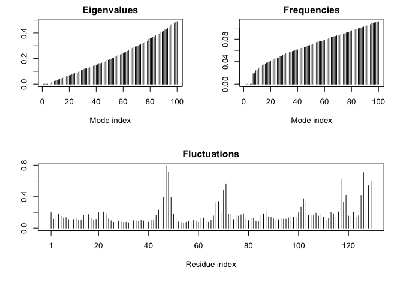

Class 13: Structure based drug discovery
================

Prepare HIV-protease molecule for docking
-----------------------------------------

First get a PDB structure from the online database then clean it up for docking.

``` r
library(bio3d)
file.name <- get.pdb("1hsg")
```

    ## Warning in get.pdb("1hsg"): ./1hsg.pdb exists. Skipping download

Read file into R and clean it up (remove non-protein bits) and also we will save the ligand into a separate file

``` r
hiv <- read.pdb(file.name)
hiv
```

    ## 
    ##  Call:  read.pdb(file = file.name)
    ## 
    ##    Total Models#: 1
    ##      Total Atoms#: 1686,  XYZs#: 5058  Chains#: 2  (values: A B)
    ## 
    ##      Protein Atoms#: 1514  (residues/Calpha atoms#: 198)
    ##      Nucleic acid Atoms#: 0  (residues/phosphate atoms#: 0)
    ## 
    ##      Non-protein/nucleic Atoms#: 172  (residues: 128)
    ##      Non-protein/nucleic resid values: [ HOH (127), MK1 (1) ]
    ## 
    ##    Protein sequence:
    ##       PQITLWQRPLVTIKIGGQLKEALLDTGADDTVLEEMSLPGRWKPKMIGGIGGFIKVRQYD
    ##       QILIEICGHKAIGTVLVGPTPVNIIGRNLLTQIGCTLNFPQITLWQRPLVTIKIGGQLKE
    ##       ALLDTGADDTVLEEMSLPGRWKPKMIGGIGGFIKVRQYDQILIEICGHKAIGTVLVGPTP
    ##       VNIIGRNLLTQIGCTLNF
    ## 
    ## + attr: atom, xyz, seqres, helix, sheet,
    ##         calpha, remark, call

Q1: What is the name of the two non protein resid values in this structure? What does resid correspond to and how would you get a listing of all reside values in this structure?

the two non protein resid values: H2O and MK1

resid: residues

``` r
prot <- trim.pdb(hiv, "protein")
prot
```

    ## 
    ##  Call:  trim.pdb(pdb = hiv, "protein")
    ## 
    ##    Total Models#: 1
    ##      Total Atoms#: 1514,  XYZs#: 4542  Chains#: 2  (values: A B)
    ## 
    ##      Protein Atoms#: 1514  (residues/Calpha atoms#: 198)
    ##      Nucleic acid Atoms#: 0  (residues/phosphate atoms#: 0)
    ## 
    ##      Non-protein/nucleic Atoms#: 0  (residues: 0)
    ##      Non-protein/nucleic resid values: [ none ]
    ## 
    ##    Protein sequence:
    ##       PQITLWQRPLVTIKIGGQLKEALLDTGADDTVLEEMSLPGRWKPKMIGGIGGFIKVRQYD
    ##       QILIEICGHKAIGTVLVGPTPVNIIGRNLLTQIGCTLNFPQITLWQRPLVTIKIGGQLKE
    ##       ALLDTGADDTVLEEMSLPGRWKPKMIGGIGGFIKVRQYDQILIEICGHKAIGTVLVGPTP
    ##       VNIIGRNLLTQIGCTLNF
    ## 
    ## + attr: atom, helix, sheet, seqres, xyz,
    ##         calpha, call

``` r
write.pdb(prot, file = "1hsg_protein.pdb")
```

``` r
lig <- trim.pdb(hiv, "ligand")
write.pdb(lig, file = "1hsg_ligand.pdb")
```

Docking

In order to visualize the docks and compare to the crystal conformation of the ligand we will process the all.pdbqt to a PDB format file that can be loaded into VMD. To do this we will use R and the Bio3D package.

``` r
library(bio3d)
res <- read.pdb("all.pdbqt", multi=TRUE)
write.pdb(res, "results.pdb")
```

Normal Mode Analysis
--------------------

``` r
pdb <- read.pdb("1HEL")
```

    ##   Note: Accessing on-line PDB file

``` r
#normal mode analysis
m <- nma(pdb)
```

    ##  Building Hessian...     Done in 0.022 seconds.
    ##  Diagonalizing Hessian...    Done in 0.086 seconds.

``` r
plot(m)
```



``` r
mktrj(m, mode = 7, file = "nma_7.pdb")
```
