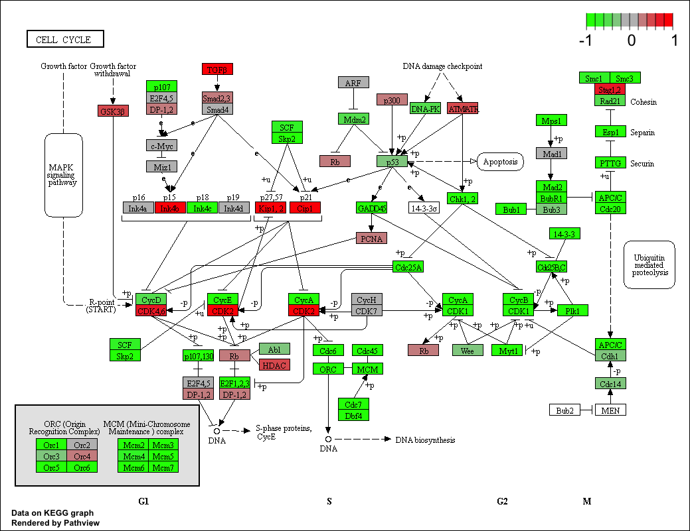

```{r setup, include=FALSE}
knitr::opts_chunk$set(echo = TRUE)
```

## Differential Expression Analysis

my input files for today's class
```{r}
metaFile <- "data/GSE37704_metadata.csv"
countFile <- "data/GSE37704_featurecounts.csv"
```
Read the metadata file first
```{r}
# Import metadata and take a peak
colData = read.csv(metaFile, row.names=1)
head(colData)
```

```{r}
countData = read.csv(countFile, row.names=1)
head(countData)

```

how to remove the length column
```{r}
countData <- as.matrix(countData[,-1])
head(countData)

#or
#dim(countData)     and then countData[,2:7]
```

How many rows and cols in count data
```{r}
dim(countData)
```

check that my metadata rows and coldata columns match

```{r}
all(rownames(colData) == colnames(countData))
```

Q. Complete the code below to filter countData to exclude genes (i.e. rows) where we have 0 read count across all samples (i.e. columns).

Tip: What will rowSums() of countData return and how could you use it in this context?


```{r}
# Filter count data where you have 0 read count across all samples.
#head(countData)

countData = countData[rowSums(countData) != 0, ]
head(countData)
dim(countData)
```


## Running DESeq2

```{r deseq_load}
library(DESeq2)
```

```{r}
dds = DESeqDataSetFromMatrix(countData=countData,
                             colData=colData,
                             design=~condition)
dds = DESeq(dds)
```

Let's get our results
```{r}
res = results(dds, contrast=c("condition", "hoxa1_kd", "control_sirna"))

```

```{r}
summary(res)
```

Volcano plot

```{r}
plot( res$log2FoldChange, -log(res$padj) )
```


```{r}
# Make a color vector for all genes
mycols <- rep("gray", nrow(res) )

# Color red the genes with absolute fold change above 2
mycols[abs(res$log2FoldChange) > 2 ] <- "red"


# Color blue those with adjusted p-value less than 0.01
#  and absolute fold change more than 2
inds <- (abs(res$log2FoldChange)>2) & (res$padj < 0.01)
mycols[ inds ] <- "blue"

plot( res$log2FoldChange, -log(res$padj), col= mycols, xlab="Log2(FoldChange)", ylab="-Log(P-value)" )
```


```{r eval = FALSE}
#source("http://bioconductor.org/biocLite.R")
#biocLite("AnnotationDbi")
#biocLite("org.Hs.eg.db")

```

```{r}
library("AnnotationDbi")
library("org.Hs.eg.db")

columns(org.Hs.eg.db)
```

```{r}
res$symbol = mapIds(org.Hs.eg.db,
                    keys=row.names(res), 
                    keytype="ENSEMBL",
                    column="SYMBOL",
                    multiVals="first")

res$entrez = mapIds(org.Hs.eg.db,
                    keys=row.names(res),
                    keytype="ENSEMBL",
                    column="ENTREZID",
                    multiVals="first")

res$name =   mapIds(org.Hs.eg.db,
                    keys=row.names(res),
                    keytype="ENSEMBL",
                    column="GENENAME",
                    multiVals="first")

head(res, 10)
```

Q. Finally for this section let’s reorder these results by adjusted p-value and save them to a CSV file in your current project directory.
```{r}
res = res[order(res$pvalue),]
write.csv(res, file="deseq_results.csv")
```


##Pathway Analysis

```{r}
#source("http://bioconductor.org/biocLite.R")
#biocLite( c("pathview", "gage", "gageData") )
```

```{r}
library(pathview)
```

```{r}
library(gage)
library(gageData)
```

```{r}
data(kegg.sets.hs)
data(sigmet.idx.hs)

# Focus on signaling and metabolic pathways only
kegg.sets.hs = kegg.sets.hs[sigmet.idx.hs]

# Examine the first 3 pathways
head(kegg.sets.hs, 3)
```

The main gage() function requires a named vector of fold changes, where the names of the values are the Entrez gene IDs.

Note that we used the mapIDs() function above to obtain Entrez gene IDs (stored in res$entrez) and we have the fold change results from DESeq2 analysis (stored in res$log2FoldChange).

```{r}
foldchanges = res$log2FoldChange
names(foldchanges) = res$entrez
head(foldchanges)
```

```{r}
# Get the results
keggres = gage(foldchanges, gsets=kegg.sets.hs)
```

```{r}
attributes(keggres)
```

look at the first few down(less) pathways
```{r}
head(keggres$less)
```


```{r}
pathview(gene.data=foldchanges, pathway.id="hsa04110")
```




```{r}
# A different PDF based output of the same data
pathview(gene.data=foldchanges, pathway.id="hsa04110", kegg.native=FALSE)
```

Now, let’s process our results a bit more to automagicaly pull out the top 5 upregulated pathways, then further process that just to get the pathway IDs needed by the pathview() function. We’ll use these KEGG pathway IDs for pathview plotting below.

```{r}
## Focus on top 5 upregulated pathways here for demo purposes only
keggrespathways <- rownames(keggres$greater)[1:5]

# Extract the 8 character long IDs part of each string
keggresids = substr(keggrespathways, start=1, stop=8)
keggresids
```

Finally, lets pass these IDs in keggresids to the pathview() function to draw plots for all the top 5 pathways.

```{r}
pathview(gene.data=foldchanges, pathway.id=keggresids, species="hsa")
```


